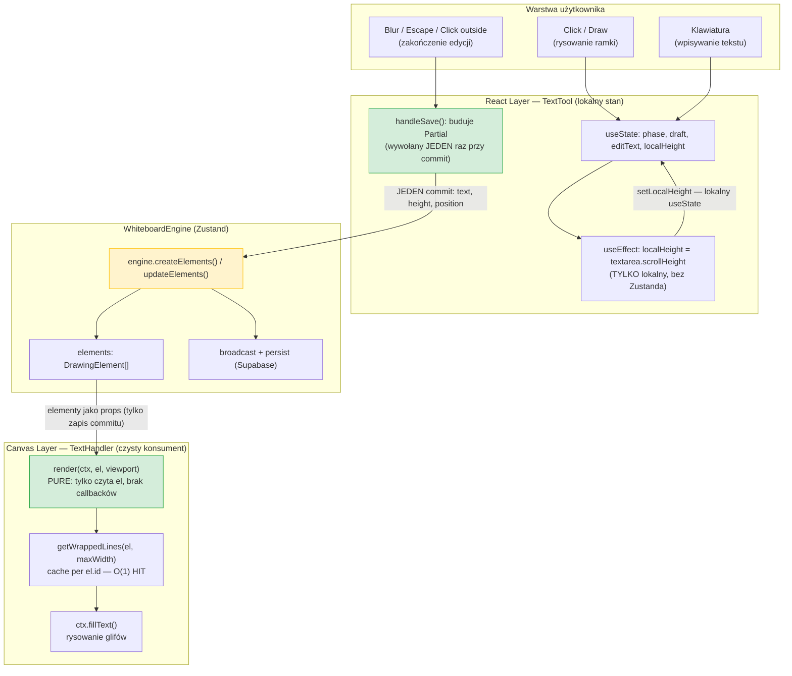
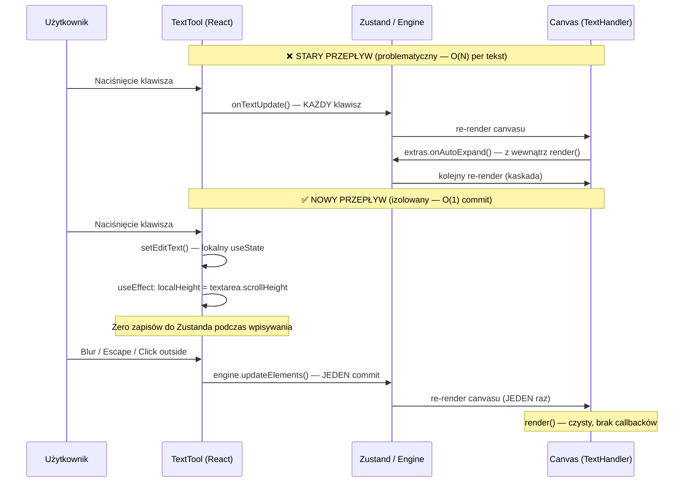

# Text Tool — Design Doc (refaktor)

> Dokument służy jako trwała baza wiedzy dla Faz 2–N refaktoru modułu tekstowego.
> Opisuje trzy zasady architektoniczne, ich uzasadnienie (Big-O + semantyka),
> kontrakt interfejsów oraz diagramy przepływu danych.

---

## 0. Diagnoza patologii (punkt wyjścia)

| # | Plik | Linia | Patologia | Koszt |
|---|---|---|---|---|
| 1 | `handlers/text-handler.ts` | ~208 | `extras?.onAutoExpand()` w `render()` — mutacja stanu z wewnątrz pętli canvasu | Kaskada: render → setState → re-render → render… |
| 2 | `components/toolbar/text-tool.tsx` | 253–263 | `useEffect` wywołuje `onTextUpdate()` przy każdej zmianie `editText` | O(N) commitów do Zustanda — N = liczba naciśniętych klawiszy |
| 3 | `handlers/text-handler.ts` | 83 | `textWrapCache.clear()` gdy rozmiar > 1000 | "Stop-the-world": kasuje WSZYSTKIE wpisy naraz; brak powiązania z `el.id` |

---

## 1. Single Source of Truth — Canvas jako czysty konsument

### Zasada

**Canvas (TextHandler) jest WYŁĄCZNIE czystym konsumentem stanu.**
Metoda `render()` czyta element i rysuje. Nigdy nie wywołuje żadnego callbacku,
który modyfikowałby stan — ani Zustanda, ani React.

```
Canvas reads. React writes. Nigdy odwrotnie.
```

### Dlaczego `onAutoExpand` w `render()` to błąd architektoniczny

Pętla renderowania canvasu (`requestAnimationFrame`) wywołuje `render()` dla każdego
widocznego elementu. Wywołanie `extras.onAutoExpand(id, height)` wewnątrz tej funkcji:

1. Triggeruje `engine.updateElements()` → mutacja Zustanda,
2. Zustand powiadamia subskrybentów → re-render komponentu,
3. Komponent planuje kolejny frame → `render()` wywołuje się znowu,
4. Jeśli wysokość nie ustabilizowała się w jednym kroku — pętla się powtarza.

Jest to **naruszenie zasady "pure render"**: funkcja z efektem ubocznym ukryta
w hot-path (wywoływanym 60×/s dla każdego elementu na ekranie).

### Kontrakt po refaktorze

```ts
// USUNIĘTE z RenderExtras:
// onAutoExpand?: (id: string, height: number) => void;

// TextHandler.render() - po refaktorze:
// - Brak parametru extras.onAutoExpand
// - Brak wywołań setState / callback wewnątrz render()
// - Metoda jest funkcją czystą: (ctx, el, viewport) → void (rysowanie)
```

Obliczanie wymaganej wysokości (`textarea.scrollHeight`) przenosi się CAŁKOWICIE
do komponentu React `TextTool`, który ma bezpośredni dostęp do DOM textarea —
bez pośrednictwa canvasu.

---

## 2. State Isolation — Izolacja stanu podczas edycji

### Zasada

Podczas edycji tekstu, komponent `TextTool` utrzymuje pełną kontrolę poprzez
**lokalny `useState`**. Zmiany tekstu i wysokości textarea **NIE są wypychane**
do globalnego Zustanda przy każdym naciśnięciu klawisza.

**Commit (synchronizacja) następuje TYLKO przy zakończeniu edycji:**

| Zdarzenie | Typ commitu |
|---|---|
| Kliknięcie poza edytorem (Click Outside) | `handleSave()` → `engine.updateElements()` |
| Utrata focusu textarea (Blur) | `handleSave()` → `engine.updateElements()` |
| Naciśnięcie Escape | `handleCancel()` → brak zapisu |
| Przełączenie narzędzia (Unmount) | `handleSave()` via `useEffect` cleanup |

### Dlaczego obecny wzorzec jest problematyczny

```tsx
// OBECNY KOD — text-tool.tsx linie 253–263 (DO USUNIĘCIA)
useEffect(() => {
  if (phase !== 'editing' || !draft?.isExisting) return;
  onTextUpdate(draft.id, {
    x: draft.worldX, y: draft.worldY,
    width: draft.worldW, height: draft.worldH,
    text: editText,                  // ← zmienia się przy każdym klawiszu
    fontSize: draft.fontSize,
    // ...
  });
// O(N) dependency array — N zmiennych triggeruje zapis
}, [editText, draft?.worldX, draft?.worldY, draft?.worldW, draft?.worldH,
    draft?.fontSize, draft?.color, draft?.fontWeight, draft?.fontStyle, draft?.textAlign]);
```

Dla tekstu o długości 500 znaków = **500 wywołań `engine.updateElements()`**,
500 mutacji Zustanda, 500 re-renderów canvasu, 500 broadcastów realtime.
Złożoność: **O(N)** gdzie N = długość tekstu.

### Wzorzec docelowy

```tsx
// NOWY WZORZEC — lokalny stan, commit tylko na terminal events
const [editText, setEditText]       = useState('');
const [localHeight, setLocalHeight] = useState(0);

// Auto-height — TYLKO lokalnie, bez Zustanda
useEffect(() => {
  if (phase !== 'editing' || !textareaRef.current) return;
  const ta = textareaRef.current;
  ta.style.height = '0px';
  const newH = Math.max(MIN_WORLD_H, ta.scrollHeight / (100 * viewport.scale));
  ta.style.height = '100%';
  setLocalHeight(newH);          // ← lokalny useState, nie Zustand
}, [editText, phase, draft?.worldW, viewport.scale]);

// Commit — dokładnie JEDEN zapis do Zustanda, na zakończenie edycji
const handleSave = useCallback(() => {
  if (!draft || !editText.trim()) { /* ... delete / cancel */ return; }
  const data: Partial<TextElement> = {
    text: editText, height: localHeight,
    x: draft.worldX, y: draft.worldY, width: draft.worldW,
    fontSize: draft.fontSize, color: draft.color,
    fontFamily: draft.fontFamily, fontWeight: draft.fontWeight,
    fontStyle: draft.fontStyle, textAlign: draft.textAlign,
  };
  if (draft.isExisting) onTextUpdate(draft.id, data);   // JEDEN raz
  else onTextCreate({ id: draft.id, type: 'text', ...data } as TextElement);
  setPhase('idle'); setDraft(null); setEditText('');
}, [draft, editText, localHeight, /* ... */]);
```

Złożoność: **O(1)** commitów do Zustanda niezależnie od długości tekstu.

---

## 3. Cache Invalidation Matrix

### Problem z obecną strategią

```ts
// handlers/text-handler.ts — OBECNY KOD (linia 83)
if (textWrapCache.size > 1000) textWrapCache.clear(); // "stop-the-world"
```

Obecny cache jest **globalnym `Map<string, string[]>`** na poziomie modułu.
Klucz: `` `${text}_${maxWidth.toFixed(1)}_${fontKey}` `` (fontKey = `ctx.font`).

Problemy:
- **Brak `el.id` w kluczu** — dwa elementy z tym samym tekstem i czcionką,
  ale na różnych pozycjach współdzielą jeden wpis (nie jest to błąd w tym przypadku,
  ale utrudnia inwalidację per-element).
- **"Stop-the-world" przy 1000 wpisach** — jednorazowe `clear()` kasuje WSZYSTKIE wpisy,
  wymuszając rekalkulację każdego widocznego elementu tekstowego w następnym framie.
  Spike kosztu obliczeniowego: O(elements × wiersze_tekstu).
- **Cache rośnie bez ograniczeń** do progu 1000 bez żadnej strategii wypierania.

### Nowa strategia: per-element cache z 6-polowym kluczem

#### Struktura

```ts
// Jeden wpis per element — nie per kombinacja parametrów
interface CacheEntry {
  key: string;    // 6-polowa krotka — patrz poniżej
  lines: string[];
}

// Lokalny w module (nie globalny singleton)
const textWrapCache = new Map<string, CacheEntry>(); // klucz = el.id
```

#### Cache Key — matryca inwalidacji

Klucz wpisu dla danego `el.id` jest konkatenacją 6 pól:

```
key = `${text}|${width.toFixed(1)}|${fontSize}|${fontFamily}|${fontWeight}|${fontStyle}`
```

| Pole | Typ | Dlaczego uczestniczy w kluczu |
|---|---|---|
| `text` | `string` | Zmiana treści → inne słowa → inne łamanie |
| `width` | `number (toFixed(1))` | Zmiana szerokości ramki → inny próg zawijania |
| `fontSize` | `number` | Zmiana rozmiaru → inne metryki glifów → inne łamanie |
| `fontFamily` | `string` | Arial vs Times vs Monospace: różne szerokości znaków |
| `fontWeight` | `'normal' \| 'bold'` | Bold font ma szersze glify — `W` w bold > `W` w normal |
| `fontStyle` | `'normal' \| 'italic'` | Italic może używać innych metryk (szczególnie w natywnych fontach) |

**Pola NIE uczestniczące w kluczu** (nie wpływają na łamanie wierszy):

| Pole | Uzasadnienie |
|---|---|
| `color` | Zmiana koloru nie zmienia szerokości tekstu |
| `x`, `y` | Pozycja elementu nie wpływa na zawijanie |
| `height` | Wysokość ramki nie wpływa na łamanie (zawijamy po szerokości) |
| `rotation` | Obrót nie zmienia metryk czcionki |
| `textAlign` | Wyrównanie nie zmienia podziału na linie (te same linie, inny offset X) |

#### Logika (pseudokod)

```ts
function getWrappedLines(
  ctx: CanvasRenderingContext2D,
  el: TextElement,
  maxWidth: number
): string[] {
  const newKey = [
    el.text, maxWidth.toFixed(1), el.fontSize,
    el.fontFamily ?? 'Arial', el.fontWeight ?? 'normal', el.fontStyle ?? 'normal'
  ].join('|');

  const cached = textWrapCache.get(el.id);
  if (cached?.key === newKey) return cached.lines; // HIT — O(1)

  const lines = computeWrappedLines(ctx, el.text, maxWidth); // MISS — oblicz
  textWrapCache.set(el.id, { key: newKey, lines });           // Update wpisu
  return lines;
}
```

#### Inwalidacja wpisu przy usunięciu elementu

Przy usunięciu elementu tekstowego z tablicy należy wyczyścić jego wpis w cache:

```ts
// W DeleteElementsCommand.do() lub w engine.deleteElements()
textWrapCache.delete(el.id);
```

Alternatywnie (prostsze): `TextHandler` może eksportować `invalidateTextCache(id: string)`,
którą canvas wywołuje po potwierdzonym usunięciu elementu.

#### Porównanie złożoności

| Własność | Stary cache | Nowy cache |
|---|---|---|
| Lookup (HIT) | O(1) Map.get | O(1) Map.get |
| Lookup (MISS) | Oblicz + O(1) Map.set | Oblicz + O(1) Map.set |
| Purge kosztu | O(cache.size) przy > 1000 wpisów | O(1) per usunięty element |
| Rozmiar cache | Rośnie do 1000 bez strategii | Bounded = #elementów tekstowych na tablicy |
| Izolacja elementów | ❌ Wpisy mogą być współdzielone między el. o tych samych params | ✅ Jeden wpis per `el.id` |
| False hit (inny el., te same params) | ❌ Możliwy (brak `el.id` w kluczu) | ✅ Niemożliwy |

---

## 4. Data Flow Diagram

### Nowy przepływ — tworzenie i edycja tekstu



### Sekwencja: Stary vs Nowy przepływ (keystroke)



---

## 5. Niezmienniki (Invariants)

Poniższe zasady MUSZĄ być zachowane po każdym commicie dotyckającym modułu tekstowego:

1. **Canvas nigdy nie wywołuje callbacków mutujących stan.**
   `TextHandler.render()` nie przyjmuje ani nie wywołuje `onAutoExpand`
   ani żadnej innej funkcji modyfikującej Zustand/React state.

2. **Jeden wpis cache per element.**
   `textWrapCache` jest `Map<el.id, CacheEntry>` — dla danego `el.id`
   istnieje co najwyżej jeden wpis. Zmiana dowolnego z 6 pól klucza → MISS → update.

3. **Zero commitów do Zustanda w trakcie edycji.**
   Między `setPhase('editing')` a `handleSave()`/`handleCancel()` — zero wywołań
   `engine.updateElements()` / `engine.createElements()`.

4. **Commit dokładnie raz.**
   `handleSave()` i `handleCancel()` wywołują engine maksymalnie JEDEN raz
   i natychmiast resetują fazę (`setPhase('idle')`), uniemożliwiając podwójny commit.

5. **Auto-height bez pośrednictwa canvasu.**
   Wysokość edytora pochodzi wyłącznie z `textarea.scrollHeight` (DOM React),
   nigdy z `reqPx / (viewport.scale * 100)` obliczonego w `render()`.

---

## 6. Pliki objęte refaktorem (Faza 2)

| Plik | Zmiana |
|---|---|
| `handlers/text-handler.ts` | Usunięcie `onAutoExpand` z `render()` i `RenderExtras`; nowa strategia cache per `el.id` |
| `components/toolbar/text-tool.tsx` | Usunięcie `useEffect` O(N); `localHeight` jako `useState`; commit tylko na terminal events |
| `handlers/types.ts` | Usunięcie `onAutoExpand?` z `RenderExtras` (jeśli tam zdefiniowane) |

**Bez zmian (świadomie):**
- `tools/text.tool.tsx` — adapter ToolDefinition pozostaje bez zmian
- `handlers/` pozostałe handlery — ortogonalna oś, nie dotykamy
- `engine/` — WhiteboardEngine nie zmienia kontraktu
